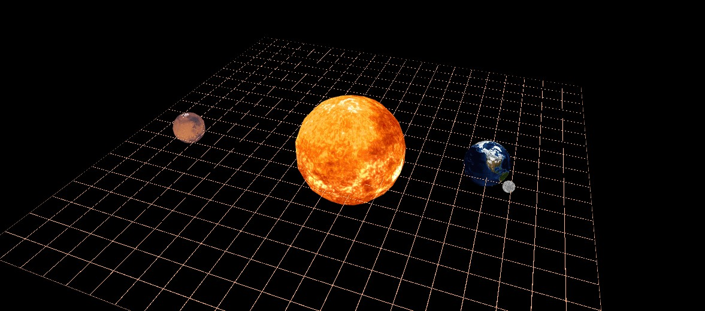
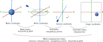
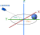

# ICG Exercise 4: Geometric transforms in the GPU pipeline

<nav>

* [Practice 0.1 - JS Console and Debugger](#practice-console-and-debugger)
* [Practice 0.2 - gl-matrix](#practice-gl-matrix-in-the-console)
* [Task 1.1 - 2D translation in shader](#task-1.1-2d-translation-in-shader)
* [Task 1.2 - 2D matrix-transform](#task-1.2-2d-matrix-transform)
* [Task 2.1 - Model-view-projection](#task-2.1-mvp-matrix)
* [Task 2.2 - View matrix](#task-2.2-view-matrix)
* [Task 2.3 - Model matrix](#task-2.3-model-matrix)
</nav>

<figure></img></figure>

## Web technologies

The exercises involving the GPU pipeline will be implemented as web-applications run in a browser.
The GPU API available in the browser is called [WebGL](https://developer.mozilla.org/en-US/docs/Web/API/WebGL_API).
Since WebGL is not convenient to use directly, we take advantage of the [regl.js](https://github.com/regl-project/regl) library which allows us to configure the GPU pipeline in a declarative way.

In previous years, the exercises were implementing using C++ and OpenGL, but we have made the change due to the following reasons:

* Nothing to install
* No compilation step, refresh page to run again
* Convenient API of [regl.js](https://github.com/regl-project/regl/blob/gh-pages/API.md)
* Projects can be easily shared on the web
* C++/OpenGL errors are hard to resolve

We believe the raw OpenGL API is too low-level and stateful, making the core concept of the GPU pipeline hard to see.
The OpenGL version of this exercise involved around 30 source files, while this WeblGL+regl version is about 400 lines total.
We hope this will help you learn and empower you to create even more amazing projects.


### Application structure

The main parts of a web-application are:

* an HTML document, the content of the website
* JavaScript code run in the browser, makes the application interactive.

In our exercises, the HTML is very simple and only contains the WebGL viewport (`<canvas>`) and some overlays where we can display text.
The document references the JavaScript files which are executed by the application `<script src="src/main.js">`.

Here are the files you will find in this exercise:

* `index_2d_transform.html` - The file we open in browser. Specifies the layout of the application and links to the JavaScript code to load such as `<script src="src/main.js">`. This file is for the 2D part (part 1)
* `index.html` - same as above but for the 3D part (part 2)
* `src` - Code you will be editing and the code we provide.
  * `main_2d_transform.js` - Rendering code for the 2D version. Edit this file in part 1 of the exercise.
  * `main.js` - Rendering code for the 3D version. Edit this file in part 2 of the exercise.
  * `icg_web.js` - Provided code: interfacing with web APIs, such as keyboard input.
  * `icg_mesh.js` - Provided code: construction and loading of triangle meshes.
  * `icg_math.js` - Provided code: additional matrix/vector utilities.
  * `icg_grid.js` - Provided code: draws a grid at Z=0 to help you debug your 3D transforms.
* `lib` - external libraries
  * [regl.js](https://github.com/regl-project/regl) - GPU API
  * [gl-matrix](http://glmatrix.net/docs/) - vector and matrix operations.
* `style.css` - specifies the appearance of the application [what is CSS](https://developer.mozilla.org/en-US/docs/Web/CSS).


### JavaScript development, Console and debugger

Our code runs in the browser, and therefore we use the JavaScript language.
The syntax is somewhat similar to C++, but JS is dynamically typed and does not have a compilation step.
About JavaScript on this course:

* *The exercises do not involve advanced JS programming - we will mostly work on the GPU and the JS part only prepares the matrices and meshes for it.*
* If you are new to JS, it is worth practicing with a tutorial, for example [JavaScript on MDN](https://developer.mozilla.org/en-US/docs/Web/JavaScript). Web development is very popular now and you are bound to run into it sooner or later.
* We try to explain as much as we can in the exercise code comments. Reading the whole file, beyond the parts you fill in, should make everything more understandable.

  
We only need a code editor and a browser (we test the exercises for Firefox and Chromium).
Let us start by *opening index_2d_transform.html in your browser*.

The browser's **developer tools** are a critical resource for web development:
[dev tools in FireFox](https://developer.mozilla.org/en-US/docs/Tools), [dev tools in Chrome](https://developers.google.com/web/tools/chrome-devtools).

The *Console* ([Firefox](https://developer.mozilla.org/en-US/docs/Tools/Web_Console), [Chrome](https://developers.google.com/web/tools/chrome-devtools/console)) is where any errors or logs are written.
Whenever your are running the application, you should have it open.
In JS, you can log messages and objects to the console with [console.log(x)](https://developer.mozilla.org/en-US/docs/Web/API/Console/log).

In the *Debugger* ([Firefox](https://developer.mozilla.org/en-US/docs/Tools/Debugger), [Chrome](https://developers.google.com/web/tools/chrome-devtools/javascript)), you can set breakpoints (place where the program pauses) and inspect the variables' values.

If you are new to these tools, we recommend you look at the tutorials - we can not hope to explain better than them.
With the web playing a big part in the modern world, we believe the underlying technologies are worth knowing, even if they are not directly relevant to this graphics course.


#### Possible surprises of JavaScript:

* **semicolons** in JS are put in the same places as in C++, but are optional - [the parser will usually understand the code without them](https://developer.mozilla.org/en-US/docs/Web/JavaScript/Reference/Lexical_grammar#Automatic_semicolon_insertion). In rare cases having no semicolon at the end of line, or having extra newlines, can [cause unexpected errors](https://flaviocopes.com/javascript-automatic-semicolon-insertion/).

* **functions**. `(x) => { ... }` is a function defined using the [arrow syntax](https://developer.mozilla.org/en-US/docs/Web/JavaScript/Reference/Functions/Arrow_functions). Functions are first-class objects in JS and they are often stored in variables of passed as arguments.
A function created inside another function has access to the parent's variables - this is called a [closure](https://developer.mozilla.org/en-US/docs/Web/JavaScript/Closures). We use this in our framework often, for example to edit `mouse_offset` in the mouse-move handler function.

* **variables** are dynamically typed - they can take objects of any type. `let x = [0, 0, 0];` declares a [rebindable variable](https://developer.mozilla.org/en-US/docs/Web/JavaScript/Reference/Statements/let) and `const y = [0, 0, 0];` declares a [non-rebindable variable](https://developer.mozilla.org/en-US/docs/Web/JavaScript/Reference/Statements/const).
That is, we can do `x = 1;` but can not do `y = 1;`.
However, unlike C++, the object in `const` variable can be modified - we can do `y[0] = 1`;
There is also `var` which is now obsolete, it works like `let` but ignores scope.

<div class="box practice">

#### Practice: Console and debugger

* Open `index_2d_transform.html` in your browser
* Open the Console, try some basic variables and operations. Press Enter after each line, for example:
```js
let x = 1;
let y = x+5;
x
y
`${x} + 5 = ${y}`
```
* Edit `src/main_2d_transform.js`, add `console.log(frame)` inside the per-frame function (`regl.frame((frame) => { ...here... }`) to print frame properties into the console.
* Put a break-point in the render function, inspect the variables.

</div>


## GPU Pipeline

Rasterization is performed on a GPU (graphics card).
GPUs are specialized in massively parallel processing of mesh geometry and image pixels.
They operate according to a specific pipeline, 

[Introduction to the Graphics Pipeline](https://www.gamedev.net/tutorials/programming/graphics/introduction-to-the-graphics-pipeline-r3344/)

**GPU pipeline inputs**

* *Vertex attributes*: position, normal, texture coordinates...
* *Faces*: triangles of the mesh, stored as triples of indices
* *Uniforms*: data globally available to the GPU programs, it includes textures

**GPU processing steps**
* *Vertex shader*: program executed for each vertex of the mesh, calculates its position in the image, and intermediate variables used by the fragment shader.
* *Fragment shader*: program executed for each output pixel of the mesh, calculates the pixel's output color.


### regl.js pipeline specification

Let us look at the pipeline declaration in regl.js.
First the pipeline is constructed with the data which does not change during runtime.
This construction step is expensive and should be done only once.
We mark values which change in time using `regl.prop('prop_name')` - we will be able to supply them later when executing the pipeline.

At each frame, we execute the pipeline and provide the dynamic values `draw({prop_name: ...})`.

```js
const regl = createREGL();

// The pipeline is constructed only once!
const draw_triangle = regl({

	// Vertex attributes - properties of each vertes such as position, normal, texture coordinates...
	attributes: {
		// 3 vertices with 2 coordinates each
		position: [
			[0, 0.2], // [x, y] - vertex 0
			[-0.2, -0.2], // [x, y] - vertex 1
			[0.2, -0.2], // [x, y] - vertex 2
		],
	},

	// Triangles (faces), as triplets of vertex indices
	elements: [
		[0, 1, 2], // one triangle here
	],
	
	// Uniforms: global data available to the shader
	uniforms: {
		color: regl.prop('color'),
	},	

	/* 
	Fragment shader program
	Calculates the color of each pixel covered by the mesh.
	The "varying" values are interpolated between the values 
	given by the vertex shader on the vertices of the current triangle.
	*/
	vert: `
	// Vertex attributes, specified in the "attributes" entry of the pipeline
	attribute vec2 position;
			
	void main() {
		// [x, y, 0, 1]
		gl_Position = vec4(position, 0, 1);
	}`,
	
	/* 
	Vertex shader program
	Given vertex attributes, it calculates the position of the vertex on screen
	and intermediate data ("varying") passed on to the fragment shader
	*/
	frag: `
	precision mediump float;
	
	uniform vec3 color;

	void main() {
		// [R, G, B, 1]
		gl_FragColor = vec4(color, 1.); // output: RGBA in 0..1 range
	}`,
});

// Function run to draw each frame
regl.frame((frame) => {
	// Reset the canvas to black
	regl.clear({color: [0, 0, 0, 1]});
		
	// Execute the declared pipeline
	draw_triangle({
		color: [1, 0, 0], // provide the value for regl.prop('color') in uniforms.
	})
});
```

### Shaders

*Shaders* are programs which run on the GPU.
They have their own language, GLSL, which is quite similar to C, with the added [vector and matrix types](http://www.shaderific.com/glsl-types).  
[GLSL reference](http://www.shaderific.com/glsl/)  
[WebGL reference card](https://www.khronos.org/files/webgl/webgl-reference-card-1_0.pdf) page 3-4

The pipeline contains two shader programs:
* *Vertex shader*: executed for each vertex of the mesh, calculates its position in the image, and intermediate variables used by the fragment shader.
* *Fragment shader*: program executed for each output pixel of the mesh, calculates the pixel's output color.

#### Vertex shader
The vertex shader receives as input the vertex attributes specified in the `attributes:` section.
They have to be declared with the `attribute` keyword.

It can pass per-vertex data to the fragment shader, such variables are specified by the `varying` keyword.
The `varying` values are interpolated between the triangle's three vertices weighted by barycentric coordinates.

The vertex shader writes the vertex *image* coordinates to `gl_Position` which is a `vec4` ([homogenous coordinates](https://en.wikipedia.org/wiki/Homogeneous_coordinates)).

```glsl
// Vertex attributes, specified in the "attributes" entry of the pipeline
attribute vec3 position;

// Intermediate value passed on to fragment shader
varying vec2 tex_coord;

void main() {
	// intermediate value passed on to fragment shader
	tex_coord = position.xy;
	// output position [x, y, z, 1]
	gl_Position = vec4(position, 1);	
}
```

#### Fragment shader
It can receive data from the vertex shader, such variables are specified by the `varying` keyword in both shaders.
The `varying` values are interpolated between the triangle's three vertices weighted by barycentric coordinates.

The fragment shader writes the pixel color to `gl_FragColor` as `vec4(Red, Green, Blue, Opacity)`.

Both vertex and fragment shader have access to the global `uniform` values.

```glsl
// numerical precision of calculation, no consensus which one to use
precision mediump float; 

// Intermediate value from vertex shader have to be declared in both shaders
varying vec2 tex_coord;

// Access global values from the uniforms: section
uniform vec3 color;

void main() {
	// [R, G, B, 1] in 0..1 range
	gl_FragColor = vec4(color, 1.);
}
```


## Matrix operations, gl-matrix
For matrix and vector operations, we will be using [gl-matrix](http://glmatrix.net/), which is a simple library similar to the `vec3.h` file in the C++ exercise. The code of the library is quite straight-forward, see for example the [gl-matrix file mat4.js](https://github.com/toji/gl-matrix/blob/master/src/mat4.js).
We primarily use the 4x4 matrices to express transformation in 3D space - [mat4 documentation](http://glmatrix.net/docs/module-mat4.html).

### Differences from C++
**Functions instead of operators:** JavaScript does not have [operator overloading](https://en.wikipedia.org/wiki/Operator_overloading), so unlike C++ we can not express matrix multiplication with `*`.

**Printing:** Matrices and vectors are both stored as flat arrays, so a 4x4 matrix is a 16-element array. This array is what you will see if you `console.log(matrix)`. Use `mat4_to_string(m, decimals)` to format the string in a readable form.

**Output argument:** gl-matrix has been designed for fast performance and so it tries to reuse the matrix objects instead of creating new ones (objects have to be then cleared out by the garbage collector).
Therefore in nearly all its functions, the first argument is the output object to which the result is written.
```js
const M_rotation = mat4.create(); // allocate matrix
// set matrix to 45 deg rotation around Z axis
mat4.fromZRotation(M_rotation, 45 * Math.PI / 180);

const C = mat4.create();
// multiply: C = A * B
mat4.multiply(C, A, B);
```
You do not have to reuse the matrices - in our application the performance loss is insignificant.
```js
// allocate a new matrix for the result
const M_rotation = mat4.fromZRotation(mat4.create(), 45 * Math.PI / 180); 
// and
const C = mat4.multiply(mat4.create(), A, B);
```

You *can* do operations *in-place*:
```js
mat4.multiply(A, A, B); // A = A*B
```

### Extra utilities

Since gl-matrix is very basic, we are adding some convenience utilities in `src/icg_math.js`.

* `matrix.get(row, col)` - get element  (row and col and 0-indexed)
* `matrix.set(row, col, value)` - set element (row and col and 0-indexed)
* `mat4_matmul_many` - Multiply any number of matrices:
	
	```js
	//out = m1 * m2 * m3 * ...
	mat4_matmul_many(out, m1, m2, m3, ...)
	```
* `vec_to_string(vector, decimals)` - display a vector with fixed decimal places

* `matrix.toString()` - reprent a matrix as a human-readable string

<div class="box practice">

#### Practice: gl-matrix in the console

* Open `index_2d_transform.html` in your browser and open the Console
* Create a translation matrix
```js
let M_translation = mat4.fromTranslation(mat4.create(), [0, 10, 0]);
M_translation.toString()
```
* Create a rotation matrix
```js
let M_rotation = mat4.fromZRotation(mat4.create(), 45 * Math.PI / 180);
M_rotation.toString()
```
* Combine the transformations by multiplication
```js
let M_RT = mat4_matmul_many(mat4.create(), M_translation, M_rotation);
M_RT.toString()
let M_TR = mat4_matmul_many(mat4.create(), M_rotation, M_translation);
M_TR.toString()
```
* Check the resulting translation, is it the same?
```js
mat4.getTranslation([0, 0, 0], M_RT)
mat4.getTranslation([0, 0, 0], M_TR)
```
</div>


## Task 1: 2D Scene

In this part we practice 2D transformations in the GPU pipeline on the example of simple triangles.
This is the desired result.
Please run `index_2d_transform.html` and edit `src/main_2d_transform.js`.

<figure><video src="doc/icg_solar_2d_loop.webm" autoplay="true" loop="true" muted="true"> </video></figure>


<div class="box task">

### Task 1.1: 2D translation in shader

We draw a blue triangle using the `draw_triangle_with_offset` pipeline.
We want the triangle to be moved when we click and drag with the mouse.
We provide code which tracks the mouse offset and store it in `mouse_offset`.

* **1.1.1** Edit the *vertex shader* of `draw_triangle_with_offset` to apply translation to vertex position
(no need to use a matrix here).
Any compilation error of the shader program will be shown in the console.

* **1.1.2** Provide the mouse position and the color to the `draw_triangle_with_offset` call.

</div> 

<div class="box task">

### Task 1.2: 2D matrix transform

We draw a green and blue triangles using the `draw_trinalge_with_transform` pipeline,
which applies a transformation matrix to the triangle position.

* **1.2.1** Edit the *vertex shader* of `draw_trinalge_with_transform` to apply the transform matrix `mat_transform` to the vertex position vector.
* **1.2.2** Construct a translation matrix for vector `[0.5, 0, 0]`, and a rotation around Z for angle `(time * 30 deg)`. 
	Multiply the matrices in appropriate order and call the pipeline to draw:
	* A green triangle orbiting the center point
	* A red triangle spinning at `[0.5, 0, 0]`

</div> 


## Task 2: Solar System

In this part we create a 3D solar system visualization.
Please run `index.html` and edit `src/main.js`.

<figure><video src="doc/icg_solar_3d_loop.webm" autoplay="true" loop="true" muted="true"> </video></figure>


### Loading resources

Due to the [same-origin policy](https://developer.mozilla.org/en-US/docs/Web/Security/Same-origin_policy), browsers by default do not allow textures to be loaded from local files (`file://` URL) and then used in JS.
To overcome that, we host the site on a local server or change browser settings.

#### Local web server
If you have `python` installed, you can use its built-in web server to host the site at <http://localhost:8000>.
Run the following command in terminal:

```bash
cd ex4_gpu_transforms
python3 -m http.server
```

The server post will be displayed:

```bash
Serving HTTP on 0.0.0.0 port 8000 (http://0.0.0.0:8000/) ...
```

Open <http://localhost:8000/index.html> in your browser.


#### Browser settings

In **Chrome** you can allow loading data from `file://` using the `--allow-file-access-from-files` switch.

* Linux
   
  	```bash
	chromium-browser --allow-file-access-from-files index.html
	```
* Windows  

	```bash
	"C:\Program Files (x86)\Google\Chrome\Application\chrome.exe" --allow-file-access-from-files index.html
	```
	If your `chrome.exe` is not found at this location, you can find it with

	```bash
	reg query "HKEY_LOCAL_MACHINE\SOFTWARE\Microsoft\Windows\CurrentVersion\App Paths\chrome.exe"
	```

In **Firefox** you can open `about:config` and set `ecurity.fileuri.strict_origin_policy` to `false`.
Use a temporary profile or reset the setting later to avoid degrading the browser security.


### Model-view-projection

The vertex shader transforms the vertex positions from their original place in the model (mesh)
to the final position in the output image.

This is done in several steps:

* Model matrix: transforms model to world coordinates (variable: `actor.mat_model_to_world`, where *actor* is the object holding information about the current model)
* View matrix: transforms world coordinates into coordinates relative to the camera (variable: `mat_world_to_cam`)
* Projection matrix: transforms from camera frame to the homogenous coordinates in the image (variable: `mat_projection`).

<figure> </img></figure>

There are further articles on that topic:

* Visualization: [Model View Projection](https://jsantell.com/model-view-projection) by Jordan Santell
* Example matrices:  [World, View and Projection Transformation Matrices](http://www.codinglabs.net/article_world_view_projection_matrix.aspx).

The projection matrix is already given in our code, we ask you to calculate the remaining steps and combine them into the final model-view-projection matrix.

<div class="box task">

### Task 2.1: MVP matrix

* **2.1.1** Edit the *vertex shader* of `draw_sphere` to apply the transform matrix `mat_mvp` to the vertex position vector.
	The solution is the same as **1.2.1**.
* **2.1.2** Calculate the MVP matrix `mat_mvp`.
	The model matrix is given as `actor.mat_model_to_world`, the view matrix is `mat_world_to_cam` and the projection is `mat_projection`.

</div> 

<div class="box task">

### Task 2.2: View matrix

Construct the view matrix in the `update_cam_transform` function and store it in the variable `mat_world_to_cam`.
We are using a "turntable" camera, it always looks at the origin point `[0, 0, 0]` and we can turn it around with the mouse.

* The distance from the camera to `[0, 0, 0]` is `r = cam_distance_base*cam_distance_factor`.
* The angle between the camera's forward-ray and the XY plane is `cam_angle_y`.
* The XY plane is rotated by `cam_angle_z`.

<figure> </img></figure>

It is convenient to create a view matrix with the *look-at* function `mat4.lookAt(out, eye, target, up)`.
But you should also combine it with rotations to achieve the turn-table effect.
[More about the look-at function](https://www.scratchapixel.com/lessons/mathematics-physics-for-computer-graphics/lookat-function).

</div> 


<div class="box task">

### Task 2.3: Model matrix

Construct the model matrix in the `calculate_actor_to_world_transform(actor)` function and store it in `actor.mat_model_to_world`.

* Each celestial body spins around its Z axis, the angle of rotation is `sim_time * actor.rotation_speed`.

* The original mesh is a unit sphere, we scale it by `actor.size` to achieve the desired size.

* Planets can orbit around other bodies. The parent body (around which we are orbiting) is stored in `actor.orbits`; the Sun's parent is `null`.
	The parent's model matrix is `actor.orbits.mat_model_to_world`, the orbit angle is `sim_time * actor.orbit_speed + actor.orbit_phase` and the radius `actor.orbit_radius`. Planets orbit in the XY plane.

</div> 


## What to submit

A .zip compressed file named `ExerciseN-GroupG.zip`, where *N* is the number of the current exercise sheet, and *G* is the number of your group. 
It should contain:

* The files you changed (in this case `src/main.js`, `src/main_2d_transform.js`).
* A couple of screenshots clearly showing that you can display the planets, and that you can turn and zoom the camera.
* A `readme.txt` file containing a description of how you solved each part of the exercise (use the same numbers and titles) and whatever problems you encountered.
*Indicate what fraction of the total workload each project member contributed.*

Submit solutions to Moodle before the deadline. Late submissions receive 0 points!


<div class="box grade">

### Grading

* **10%** Task 1.1: 2D translation in shader 
* **20%** Task 1.2: 2D matrix transform 15%
* **10%** Task 2.1: MVP matrix
* **30%** Task 2.2: View matrix
* **30%** Task 2.3: Model matrix

</div> 
