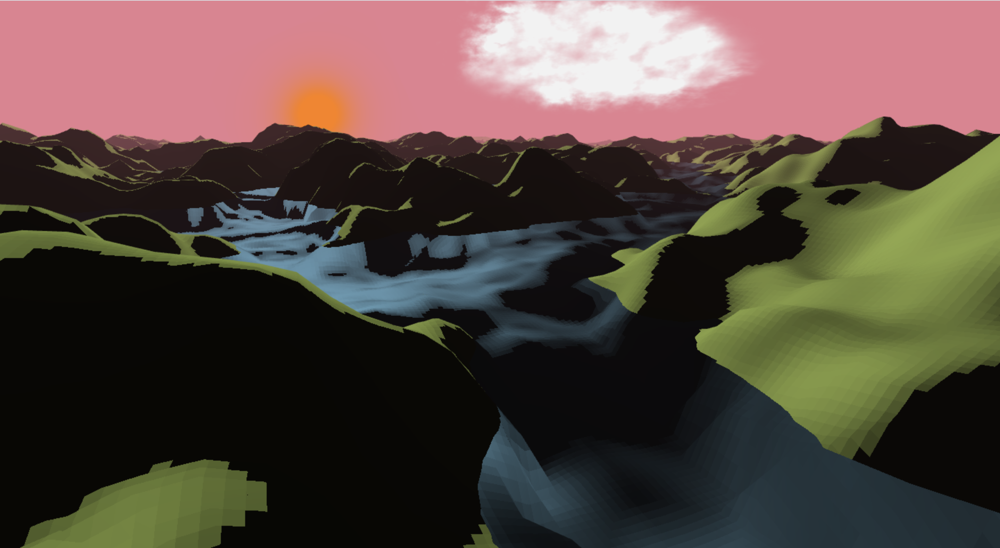
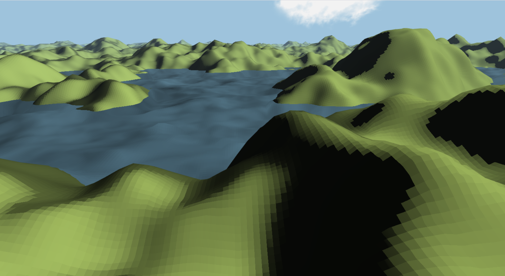
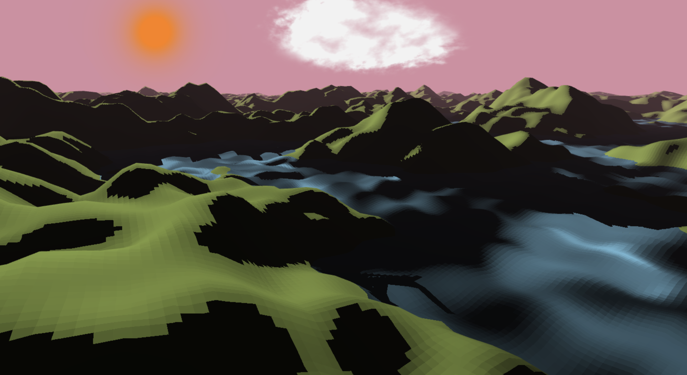
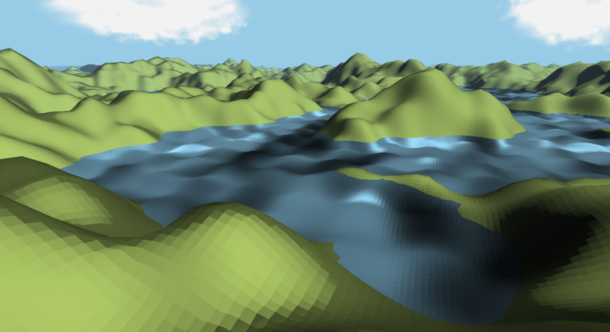
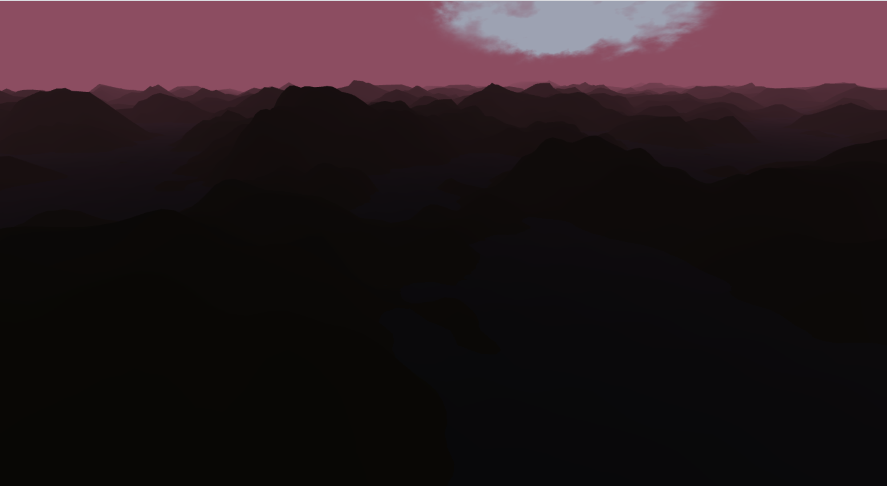

# Perlin-noise based realistic mountain terrain

## Final Deliverables

### Abstract

We created an infinite mountain range terrain generated by perlin noise with the appropriate elevation texture (height map) and the appropriate phong lighting. We are simulating the immensity of the terrain by using a big blender object that has higher resolution in the foreground than in the background and we hide the background with fog. Our project also includes directional shadows that simulates a light source that is at infinity. We’ve also implemented a day and night cycle with sunset / sunrise and simulated real water using both trigonometric functions and 3D perlin noise. There is also unique random realistic clouds above the terrain. Using “awsd” we can move around with the camera in each of the directions and explore the never-ending terrain.

### Technical approach

**Infinite terrain:**
    

-   Starting on the code from assignment 7, we moved the terrain rendering into the shader by passing the height map generated by perlin noise into the .vert as a texture2d. Then we used the rgb value of this texture to set the height of the terrain.
    
-   Moving around in the terrain: To move around we added some code for each key awsd, and we created a 2D offset vector that we can use to offset the perlin noise. The code takes into account the direction of the camera to compute the offset, such that we move forward with ‘w’, left with ‘a’, back with ‘s’, and right with ‘d’. We can then use this offset for the perlin noise.
    
-   Make terrain appear infinite: To make the terrain infinite we needed to create a bigger mesh. To do this we created a mesh on blender and subdivided it so that the resolution of the mesh in the center if bigger, it degrades the further we are from the center. This allowed us to load a much bigger terrain that appears infinite
    

**Water:**
    

-   First approach after consulting with the TA Krzysztof was to use trigonometric functions with time to simulate the flow of water. The results were quite impressive that’s why we also include this in our final report
    
-  Secondly we implemented 3D Perlin noise to further improve the shape of water. It was really similar to the 2D perlin noise we implemented except the 12 gradients were in 3D instead and we need to do the interpolation in 3D instead of 2D. To get the 3D gradients, we referred to the paper Improved Noise by Ken Perlin (see reference). We then used trial and error to shape the water.
    

**Clouds:**
    

-   To produce realistic clouds, we used a billboard and applied perlin noise with an alpha gradient.
    
-   First, we generated the body of the cloud. We superposed a perlin noise generated texture on itself while moving the textures according to time. That created an effect where the clouds seem to move with the wind. One thing to note is that the perlin noise texture is pre-generated in a jpg format. We did that because this specific texture gives more volume to the cloud compared to other textures.
    
-   Then we worked on the edge of the cloud. We used an image of a cloud shape from the internet to generate the approximate shape. Then we smudge the edge of the cloud using another perlin noise function. We also shift this edge according to the time so the cloud shape seems to change with time.
    
-   Finally, we add and multiply the above information to produce the alpha factor of the cloud. The color of the cloud is hardcoded and determined by the sky color/time of the day. After trial and error to tweak the functions, we were able to produce a realistic cloud.
    

**Directional Shadow**
    

-  We used directional shadow to simulate an infinite sun. Implementing directional shadow was not too hard compared to perspective shadows: we follow what we did in previous assignments and change the projection matrix from perspective to orthogonal.
    
-   However, we had some bugs because our normal and our transformation matrices were wrong sometimes. Debugging shadow took a while: we had to add additional code to visualize the shadow (e.g. when you click H where you are running the simulation). We also reduced the size of the terrain and placed the sun at the horizon to be able to better visualize what shadow should look like. We also added a plane right below the terrain because without the plane, we had shadow issues when the sun was below the horizon
    

**Day/night transition**
    

-   We rotated the sun around our terrain using transformation matrices. That will create shadows and make the terrain dark at night.
    
-   We also changed the sky color depending on time.
    
-  Combining the above points with the shadow simulated day/night transition.

**Sun**
    

-   We added a sun using a billboard. To make the sun always look at the camera, we used transformation matrices.
    

**Fog**
    

-   We added fog to make the terrain look infinite on the horizon. To do it, we just mix the color of the terrain with the color of sky in the terrain.vert, using the distance from the camera as the weight.

**Phong lighting**

-   We implemented phong lighting from what we learned in class.

### Problems encountered

**Directional Shadow**
    

-   As mentioned earlier, we had some trouble debugging our directional shadowmap mostly due to bugs in our code. We tackled the problem by adding tools to help up debug (e.g. the shadow map visualization). We also reduced the size of the terrain and placed the sun at the horizon to be able to better visualize what shadow should look like. Many of those efforts were suggested after our meeting with the TA and it was a great help for us.
    

**Infinite terrain**
    

-   When changing the terrain to much bigger scale, the shape of the water changed drastically and it was hard to get great results back
    
-   Adding additional object that changes resolution
    

**Normals**
    

-   Because we are procedurally generating the terrain, we had to compute the normals which were used for the lighting. We kept updating our terrain and improving the waves so updating the normals became tricky at the end.
    

**3D perlin noise**
    

-   When we were implementing 3D perlin noise for the waves, we had trouble debugging. To help, we used the visualizer of the assignment 7 to visually see our noise.

### Images

First two images include our implementation of water using 3D perlin noise.

### Colaboration

Everyone has done equal share of the project just like outlined in the midterm report.

### Resources

Perlin, Ken. "Improving noise." Proceedings of the 29th annual conference on Computer graphics and interactive techniques. 2002.
