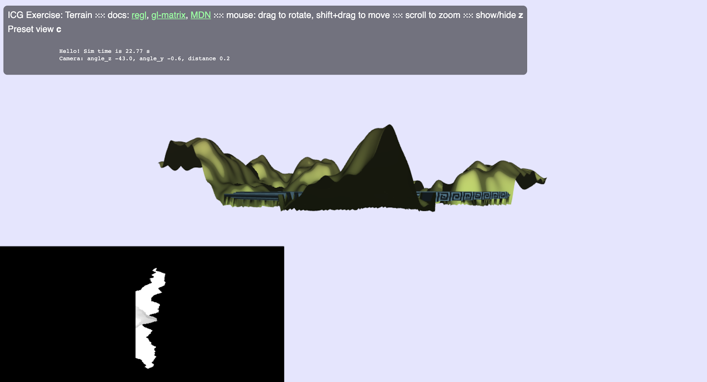
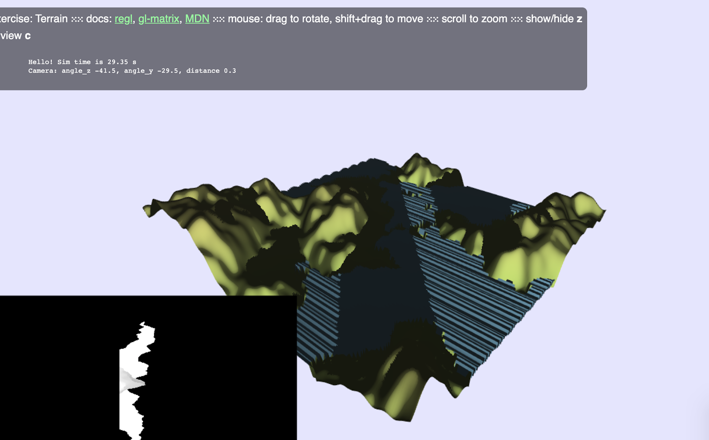
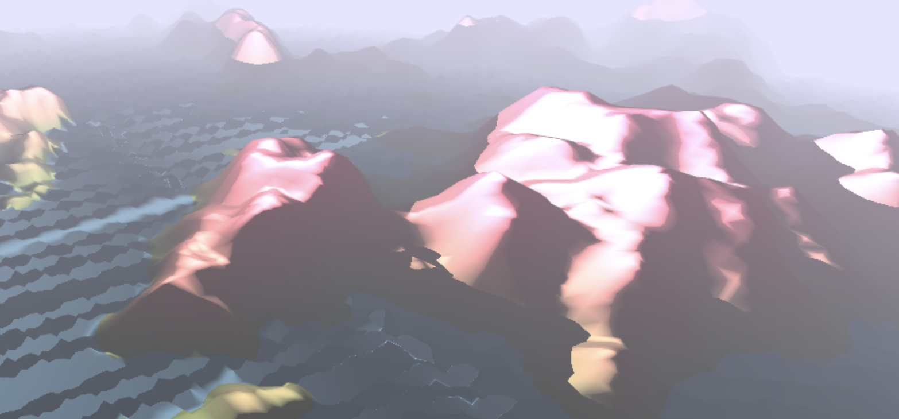

# Perlin-noise based realistic mountain terrain report

### Current Progress

* Core Goal - Infinite landscape on the GPU
    * enlarged the terrain map
    * added fog in the background, which masks terrain and water very far away

Extension goals

* Water simulation [0.5]
    * played around with the waves functions
    * added time simulation, changing the shape of water waves
    * tried to implement a simple water texture

* Directional shadows [0.5]
    * Adapt the shadow-mapping technique to a light source that is at infinity (sun), all light rays are then parallel.
       Almost done. There are directional shadows in our terrain now.
     * Issues:
       * Only part of the terrain has shadows. Can be fixed by increasing the size of the box for directional shadow.
       * Visualizing the shadow map doesn’t work at all for big terrain. It might be an indication that my shadow map is wrong. Still debugging.
       * My phong lighting might be wrong because it's still using a light position. Can be fixed by putting the light position really far away.
    * Animate the sun's movement and color throughout the day.
     * To be done

Orthogonal shadow on the bottom left. Perspective view of the mesh in the middle. We can see that it looks similar. The result is like the second image

Current final result: terrain with fog, wave, and directional shadow

### Updated Schedule

* Week 1 (April 20)
    * Tuesday, April 21 - Project proposal due - everybody - done 
    * Friday, April 24 - Proposal feedback due - everybody - done
    * Finalize the details of the project - everybody - done
* Week 2 (April 27)
    * Set up the project files - Bartek - done 
    * Perlin noise - Bartek and Gianni - done
    * Elevation - Gianni - done 
* Week 3 (May 4)
    * Adding fog, so terrain fades out - Gianni - done
    * Moving the camera around a center point - Gianni - done
    * Phong lighting - Fan - done
    * Shadows - Fan - almost done. Some bugs remains
* Week 4 (May 11) - mostly core goal
    * Tuesday May 12, 1PM - Milestone report due - everybody
    * Infinite Terrain with the camera - Bartek and Gianni - postponed till May 18
    * Sun and moon rotation - Fan - todo
    * Day and night transition -Fan - todo
* Week 5 (May 18) - extensions
    * Realistic water(with perlin noise) - Gianni, Fan
    * Reflection of mountains on water - Bartek
    * Additional features - we’ll work on them together depending what will be the particular interest of each team member
* Week 6 (May 26)
    * Tuesday May 26, 1PM - Final presentation video due - everybody
    * Friday May 29, 1PM - Final report webpage due - everybody
